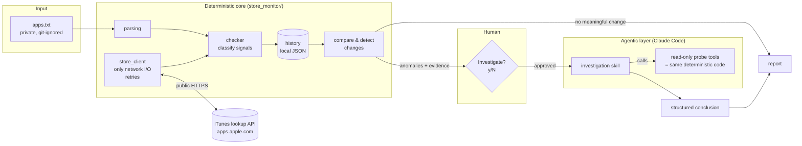
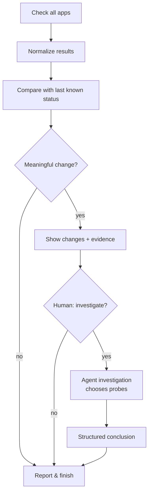

# mobile-app-intelligence

Small, deliberately designed tools for **public mobile-store intelligence**, built as a
hybrid of deterministic code and supervised AI agents.

The first (and currently only) component is **App Store Monitor**.

> **Build status.** V1 is complete. It was built in small PRs, one per milestone.
>
> | Milestone | State |
> |---|---|
> | Deterministic checker as a package, offline tests | ✅ |
> | Local run history + change/anomaly detection | ✅ |
> | Human-approved agentic investigation (Claude Code) | ✅ |
> | Agent evaluation scenarios | ✅ |

---

## 1. What problem does it solve?

If you publish or track many iOS apps, apps silently disappear: removed by Apple, pulled
from one region, delisted by the developer. App Store Monitor checks a list of App Store
apps, says which are **LIVE / REMOVED / UNCERTAIN / ERROR**, remembers previous runs, and
points out what **changed**. When a change is ambiguous, you can choose to have an agent
investigate it.

It uses only **public** Apple endpoints. No App Store Connect access, no credentials.

## 2. Why hybrid deterministic + agentic?

Most of this problem is ordinary software. "Does the lookup API return this ID?" and
"Did the status change since yesterday?" have exact answers that code computes cheaply,
reproducibly, and testably. An LLM would add cost, latency, and non-determinism without
adding accuracy.

What's left is a small number of **ambiguous cases**: the lookup API says the app exists
but the page 404s, an app vanishes from one storefront only, or a status flips and recovers.
Here the useful work is *deciding which evidence to collect next and interpreting
conflicting signals*. That fits an agent better than a growing pile of `if` statements.

So the rule is: **code establishes facts, the agent interprets ambiguity, a human decides.**

## 3. Architecture



The agent never gets its own HTTP access. Every probe it runs goes through the
same `StoreClient` and `checker` code the monitor uses. That keeps the data
consistent and tested, and limits what the agent can do.

## 4. Workflow



## 5. Responsibilities

| Responsibility | Approach |
|---|---|
| Fetch store status (lookup + page) | Deterministic |
| Retry timeouts, 429, 5xx | Deterministic |
| Classify known signal combinations | Deterministic |
| Compare with previous run | Deterministic |
| Detect state changes | Deterministic |
| Decide what extra evidence an ambiguous case needs | Agentic |
| Interpret conflicting evidence | Agentic |
| Any action based on the result | Human |

## 6. Degree of autonomy

V1 uses **supervised autonomy (human in the loop)**:

- Detection runs automatically on every check.
- Investigation **never** starts on its own. The CLI shows what changed and asks first.
- The agent is read-only: public store data and local history only. It cannot write
  anywhere or reach App Store Connect or any production system.

## 7. Running locally

Requires Python 3.10+. No third-party dependencies. Investigations additionally need the
[Claude Code](https://claude.com/claude-code) CLI (`claude`) installed and logged in.

```bash
git clone https://github.com/rcanbaba/mobile-app-intelligence.git
cd mobile-app-intelligence

# try it with the public example list
python3 -m store_monitor check examples/apps.example.txt

# your own list (git-ignored)
cp examples/apps.example.txt apps.txt
python3 -m store_monitor check                        # reads apps.txt
python3 -m store_monitor check apps.txt --csv out.csv # also export CSV
python3 -m store_monitor check --only problem         # REMOVED/UNCERTAIN/ERROR/...
python3 -m store_monitor check -w 12                  # 12 parallel workers
pbpaste | python3 -m store_monitor check -            # from clipboard (macOS)
python3 -m store_monitor check --no-history           # one-off check, nothing saved

# history
python3 -m store_monitor history                      # list past runs
python3 -m store_monitor history 389801252            # one app's timeline
python3 -m store_monitor history 389801252 --json     # machine-readable

# investigation (also offered interactively after a check with status changes)
python3 -m store_monitor investigate                  # latest run with status changes
python3 -m store_monitor investigate 20261008T091500Z --model sonnet --max-budget-usd 0.5
python3 -m store_monitor probe 389801252 --countries us,gb,tr   # the agent's probe tool, JSON
```

Every `check` compares the new results with local history and then saves the run to
`.monitor/runs/` (git-ignored; `--state-dir` changes the location).

Tests run offline. Network responses are scripted:

```bash
python3 -m unittest                                   # all
python3 -m unittest tests.test_checker                # one module
python3 -m unittest tests.test_checker.ClassificationTest.test_globally_removed_app
```

## 8. Input format

See [`examples/apps.example.txt`](examples/apps.example.txt). It lists well-known public
apps and shows every accepted line shape:

```
Instagram	https://apps.apple.com/us/app/instagram/id389801252
368677368
Some Beta Build	https://testflight.apple.com/join/EXAMPLE
```

- One app per line: `label <TAB> url`. Two or more spaces, or a comma, also work as separators.
- A bare numeric ID is enough; the name comes from the lookup API.
- The storefront country comes from the URL (`/us/`, `/gb/`...). Otherwise the default is
  `--default-country` (default `us`). `--country xx` forces one storefront for every line.
- Lines without an App Store link are reported as `NO_LINK` / `SKIPPED` and not checked.

## 9. Status model

Each app gets two independent signals, which are cross-checked:

1. **Lookup**: `itunes.apple.com/lookup?id=<id>&country=<cc>`. Does this storefront return the app?
2. **Page**: `apps.apple.com/<cc>/app/id<id>`. Only 404/410 count as "gone". 429/5xx/timeouts
   count as "unknown", never as "gone".

| Status | Meaning |
|---|---|
| `LIVE` | Lookup returns the app and the page isn't gone |
| `REMOVED` | Empty lookup in the storefront **and** a fallback storefront, **and** page 404/410 |
| `UNCERTAIN` | Signals disagree, or the app exists only in the fallback storefront |
| `ERROR` | The check itself failed (network, server error, malformed response) |
| `NO_LINK` / `SKIPPED` | Input line has no App Store link |

Neither signal is trusted alone because the lookup API sometimes serves stale cached
answers. The fallback storefront is `us`, or `gb` when the app's own storefront is already `us`.

### History and change detection

Each run is saved as one JSON file. An app's history identity is
`app_id@storefront`: the same app can be LIVE in one country and missing in another.

| Situation | Result | Investigation offered? |
|---|---|---|
| App not in history yet | `NEW`: this run is its baseline | No |
| Same status as last known | unchanged, not listed | No |
| Different status (e.g. `LIVE → REMOVED`, `UNCERTAIN → LIVE`) | `STATUS_CHANGE`, shown with current and previous evidence | Yes |
| Check returned `ERROR` | `CHECK_FAILED`, shown with consecutive-error count | No (rerun first) |

"Last known" skips `ERROR` results. So `LIVE → ERROR → LIVE` is not a change, and
`LIVE → ERROR → REMOVED` is reported as `LIVE → REMOVED`. A network failure is a
fact about the check, not about the app.

```
History: compared with 4 previous run(s).
42 apps checked. 40 unchanged. 2 status change(s), 0 failed check(s), 0 new.

Status changes:
  App A  123456789@us  LIVE → REMOVED
    now:    lookup empty, GB lookup empty, page 404
    before: lookup found, page 200 (run 20261008T091500Z)
```

## 10. Agent investigation

When a check finds status changes, the CLI asks:

```
Investigate 2 status change(s) with Claude Code? [y/N]
```

Answering `y` (or later running `python3 -m store_monitor investigate`) starts one
headless Claude Code session. On `N`, or when input is piped, nothing runs.

| | |
|---|---|
| **Instructions** | [`.claude/skills/investigate-store-anomaly/SKILL.md`](.claude/skills/investigate-store-anomaly/SKILL.md): method, classifications, confidence rules. The same file is an interactive Claude Code skill (`/investigate-store-anomaly <case.json>`) and the system prompt of the headless run, so the two can't drift apart. |
| **Context (what it sees)** | A *case* with only the anomalies of one run: previous → current status, the raw signals behind both, and each app's timeline. Not the whole portfolio. |
| **Tools (what it can use)** | `store_monitor probe` (fresh lookup + page per storefront; rerunning it is how the agent retries) and `store_monitor history --json`. These are the same deterministic code paths the monitor uses. |
| **Cannot** | Use any other command or tool, fetch arbitrary URLs, write files, read repository files (like your private `apps.txt`), or load your personal Claude Code settings or MCP servers. The run uses `--tools Bash`, an allowlist of the two commands, `--setting-sources project`, `--strict-mcp-config`, and a `--max-budget-usd` cap. It runs in an **empty temporary working directory**, because Claude Code auto-approves some read-only shell commands inside the working directory (found by the evals, see below). Blocked calls are recorded. |
| **Output** | A JSON-schema-enforced conclusion per anomaly: `classification`, `evidence[]` (each tagged `case` / `probe` / `history`), `likely_explanation`, `confidence`, `remaining_uncertainty`, `recommended_human_action`. |
| **Guardrail** | The conclusion is validated again in code: every anomaly answered exactly once, valid enums, evidence present, no `INCONCLUSIVE` with `high` confidence. Failures are reported, not hidden. |
| **Saved** | `.monitor/investigations/<run_id>/`: `case.json`, `trace.jsonl` (full event stream), `conclusion.json` (conclusion, tool-call trace, validation result, cost). |

Classifications: `REMOVED_GLOBALLY`, `REGIONAL_UNAVAILABILITY`, `RECOVERED`,
`TRANSIENT_SIGNAL`, `PERSISTENT_CONFLICT`, `INCONCLUSIVE`.

Example, with a simulated `LIVE → REMOVED` record for a live app:

```
  → python3 -m store_monitor probe 389801252 --countries us,gb,de,jp,tr; python3 -m store_monitor history 389801252 --json
  → python3 -m store_monitor probe 389801252 --countries us

Instagram  389801252@us
  Classification: TRANSIENT_SIGNAL  (confidence: high)
  Evidence:
    - [case] Run recorded REMOVED: us lookup empty, page 404, gb fallback empty; previous run LIVE
    - [probe] All five storefronts (us, gb, de, jp, tr): lookup found v450.1.0, page 200
    - [probe] A second us probe confirms: lookup found, page 200
  Likely explanation: The REMOVED result does not reproduce; the current status matches the previous LIVE...
  Remaining uncertainty: Public data can't tell whether the REMOVED record came from a brief Apple inconsistency...
  Recommended action: No store action needed; confirm the next check records LIVE.

2 tool call(s) · 4 turns · $0.127
```

## 11. Evaluation strategy

Two separate layers:

**Deterministic tests** (`tests/`, ✅). Classification logic runs against scripted signals:
normal app, globally removed, region-specific availability, network timeout, conflicting
lookup/page signals, malformed lookup response, 429/5xx never mistaken for removal.
Change detection runs against a temporary history: first sighting, recovery, error blips,
changes hidden behind errors, separate storefronts.

**Agent evaluations** (`evals/`, ✅) run the *real* investigation: same skill, flags and
tools as production. Only the world underneath is fixed. Each scenario in
[`evals/scenarios/`](evals/scenarios) defines the history, the run that raised the anomaly,
and recorded store responses. When `STORE_MONITOR_FIXTURE` is set, `probe` replays these
instead of calling Apple. Responses can change between calls, so retries are testable.

```bash
python3 -m evals.run                                  # all scenarios (~$0.60 total)
python3 -m evals.run persistent_conflict --trials 3   # one scenario, repeated
python3 -m evals.run --model sonnet                   # compare models
```

| Scenario | Recorded world | Must conclude | Also checked |
|---|---|---|---|
| `regional_unavailability` | Gone in TR, live elsewhere | `REGIONAL_UNAVAILABILITY` | probed own storefront |
| `global_removal` | Gone everywhere | `REMOVED_GLOBALLY` | probed own storefront |
| `transient_blip` | Recorded REMOVED, live on probe | `TRANSIENT_SIGNAL` | not `REMOVED_GLOBALLY` |
| `recovery` | REMOVED twice, now live | `RECOVERED` | |
| `persistent_conflict` | Lookup found + page 404 on every retry | `PERSISTENT_CONFLICT` / `INCONCLUSIVE` | retried own storefront ≥2×, confidence ≤ medium |
| `probes_failing` | Every probe times out | `INCONCLUSIVE` | confidence low |
| `malformed_responses` | Lookups return malformed JSON | not `REMOVED_GLOBALLY` | confidence ≤ medium |

Every trial is also graded on: schema-valid conclusion, at least one piece of evidence
from a fresh probe, and no command outside the two tools. Grading is plain code, not an
LLM judge, because every check is objective. Results go to `.monitor/evals/`. The
harness itself (fixture replay, world building, graders) has offline tests.

Current result: **7/7 scenarios pass**, about $0.09 and 1–2 tool calls per scenario.

#### What the evals caught

The first eval runs found three real problems. Unit tests had caught none of them:

1. **A crash.** Some Claude Code stream events have a string `message`; the trace parser assumed an object.
2. **A permission gap.** The agent ran `echo`, which isn't in the allowlist, and Claude
   Code didn't block it. Following up showed that read-only commands such as `wc -l
   apps.txt` were also auto-approved inside the working directory. The agent could have
   read the private app list. Fix: the agent now runs in an empty temp directory, and the
   skill says plainly that no other shell commands are allowed. The tool-boundary check
   in the eval stays strict.
3. **An ambiguous definition.** In `persistent_conflict` the agent answered "high
   confidence". Its reasoning was right; it was sure the conflict was real. But
   "confidence" had never been defined as *confidence in the app's real state*. The skill
   now says so, and `PERSISTENT_CONFLICT` / `INCONCLUSIVE` with `high` confidence are
   rejected in code. After the change: 3/3 trials pass.

## 12. Privacy and safety

- This repository contains **no private app portfolio**. Real input lists, CSV exports,
  history, and investigation files are git-ignored. `examples/` holds only well-known public apps.
- V1 reads only public Apple endpoints, with no credentials.
- The agent is read-only and every investigation requires explicit human approval.

## 13. Roadmap

- **V1:** local CLI, run history, change detection, supervised agent investigation.
- **V2:** local web dashboard (check button, current status, change history, anomaly cards,
  investigate button, investigation trace).
- **Future:** more public mobile-store intelligence tools (metadata analysis, competitor tracking).

## 14. Design decisions

- **No backend, no database, no queue in V1.** A local CLI and JSON files are enough for one
  person running checks by hand. SQLite comes only if history queries outgrow files.
- **No LLM call for ordinary results.** If nothing meaningful changed, no model is invoked.
- **No multi-agent system.** One investigator with a few read-only tools covers the problem.
- **No MCP server just for the sake of it.** The agent calls the CLI's own probe commands.
- **Zero runtime dependencies.** Standard library only, so it runs anywhere `python3` does.
- **One network module.** `StoreClient` is the only code that does I/O, which makes the
  logic testable offline and replayable in agent evals.
- **Code-graded evals, not an LLM judge.** The expected outcomes are objective, so plain
  assertions are cheaper, deterministic and easier to trust.
- **Defense in depth for the agent.** Tool allowlist, isolated working directory, ignored
  user settings, budget cap, schema-enforced output, and a second validation in code.
  The evals showed why one layer isn't enough.
