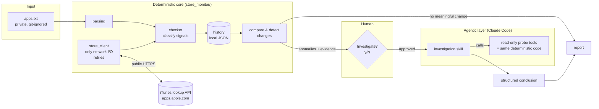
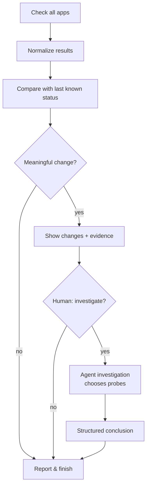

# mobile-app-intelligence

Small, deliberately designed tools for **public mobile-store intelligence**, built as a
hybrid of deterministic code and supervised AI agents.

The first (and currently only) component is **App Store Monitor**.

> **Build status.** V1 is being built in small PRs. This README describes the V1 design;
> each milestone is marked ✅ (in `main`) or 🚧 (planned in V1).
>
> | Milestone | State |
> |---|---|
> | Deterministic checker as a package, offline tests | ✅ |
> | Local run history + change/anomaly detection | 🚧 |
> | Human-approved agentic investigation (Claude Code) | 🚧 |
> | Agent evaluation scenarios | 🚧 |

---

## 1. What problem does it solve?

If you publish or track many iOS apps, apps silently disappear: removed by Apple, pulled
from one region, delisted by the developer. App Store Monitor checks a list of App Store
apps, says which are **LIVE / REMOVED / UNCERTAIN / ERROR**, remembers previous runs, and
points out what **changed**. When a change is ambiguous, you can choose to have an agent
investigate it.

It uses only **public** Apple endpoints. No App Store Connect access, no credentials.

## 2. Why hybrid deterministic + agentic?

Most of this problem is ordinary software. "Does the lookup API return this ID?" and
"Did the status change since yesterday?" have exact answers that code computes cheaply,
reproducibly, and testably. An LLM would add cost, latency, and non-determinism without
adding accuracy.

What's left is a small number of **ambiguous cases**: the lookup API says the app exists
but the page 404s, an app vanishes from one storefront only, or a status flips and recovers.
Here the useful work is *deciding which evidence to collect next and interpreting
conflicting signals*. That fits an agent better than a growing pile of `if` statements.

So the rule is: **code establishes facts, the agent interprets ambiguity, a human decides.**

## 3. Architecture



The agent never gets its own HTTP access. Every probe it runs goes through the
same `StoreClient` and `checker` code the monitor uses. That keeps the data
consistent and tested, and limits what the agent can do.

## 4. Workflow



## 5. Responsibilities

| Responsibility | Approach |
|---|---|
| Fetch store status (lookup + page) | Deterministic |
| Retry timeouts, 429, 5xx | Deterministic |
| Classify known signal combinations | Deterministic |
| Compare with previous run | Deterministic |
| Detect state changes | Deterministic |
| Decide what extra evidence an ambiguous case needs | Agentic |
| Interpret conflicting evidence | Agentic |
| Any action based on the result | Human |

## 6. Degree of autonomy

V1 uses **supervised autonomy (human in the loop)**:

- Detection runs automatically on every check.
- Investigation **never** starts on its own. The CLI shows what changed and asks first.
- The agent is read-only: public store data and local history only. It cannot write
  anywhere or reach App Store Connect or any production system.

## 7. Running locally

Requires Python 3.10+. No third-party dependencies.

```bash
git clone https://github.com/rcanbaba/mobile-app-intelligence.git
cd mobile-app-intelligence

# try it with the public example list
python3 -m store_monitor check examples/apps.example.txt

# your own list (git-ignored)
cp examples/apps.example.txt apps.txt
python3 -m store_monitor check                        # reads apps.txt
python3 -m store_monitor check apps.txt --csv out.csv # also export CSV
python3 -m store_monitor check --only problem         # REMOVED/UNCERTAIN/ERROR/...
python3 -m store_monitor check -w 12                  # 12 parallel workers
pbpaste | python3 -m store_monitor check -            # from clipboard (macOS)
```

Tests run offline. Network responses are scripted:

```bash
python3 -m unittest                                   # all
python3 -m unittest tests.test_checker                # one module
python3 -m unittest tests.test_checker.ClassificationTest.test_globally_removed_app
```

## 8. Input format

See [`examples/apps.example.txt`](examples/apps.example.txt). It lists well-known public
apps and shows every accepted line shape:

```
Instagram	https://apps.apple.com/us/app/instagram/id389801252
368677368
Some Beta Build	https://testflight.apple.com/join/EXAMPLE
```

- One app per line: `label <TAB> url`. Two or more spaces, or a comma, also work as separators.
- A bare numeric ID is enough; the name comes from the lookup API.
- The storefront country comes from the URL (`/us/`, `/gb/`...). Otherwise the default is
  `--default-country` (default `us`). `--country xx` forces one storefront for every line.
- Lines without an App Store link are reported as `NO_LINK` / `SKIPPED` and not checked.

## 9. Status model

Each app gets two independent signals, which are cross-checked:

1. **Lookup**: `itunes.apple.com/lookup?id=<id>&country=<cc>`. Does this storefront return the app?
2. **Page**: `apps.apple.com/<cc>/app/id<id>`. Only 404/410 count as "gone". 429/5xx/timeouts
   count as "unknown", never as "gone".

| Status | Meaning |
|---|---|
| `LIVE` | Lookup returns the app and the page isn't gone |
| `REMOVED` | Empty lookup in the storefront **and** a fallback storefront, **and** page 404/410 |
| `UNCERTAIN` | Signals disagree, or the app exists only in the fallback storefront |
| `ERROR` | The check itself failed (network, server error, malformed response) |
| `NO_LINK` / `SKIPPED` | Input line has no App Store link |

Neither signal is trusted alone because the lookup API sometimes serves stale cached
answers. The fallback storefront is `us`, or `gb` when the app's own storefront is already `us`.

## 10. Agent investigation 🚧

The plan for V1:

- **Sees:** the detected changes, each with current and previous signals, plus the app's history.
- **Can use (read-only):** probe the app in other storefronts, re-run the check to retry
  conflicting signals, read current public metadata, read local monitoring history.
- **Cannot:** fetch arbitrary URLs, write files, touch App Store Connect, or take any action.
- **Returns** a structured conclusion: classification, evidence, likely explanation,
  confidence, remaining uncertainty, recommended human action. Low-evidence cases must say so.

Claude Code itself is the agent runtime (a project skill + headless `claude -p` with a
restricted tool list), so V1 needs no separate LLM backend.

## 11. Evaluation strategy

Two separate layers:

**Deterministic tests** (`tests/`, ✅). Classification logic runs against scripted signals:
normal app, globally removed, region-specific availability, network timeout, conflicting
lookup/page signals, malformed lookup response, 429/5xx never mistaken for removal.

**Agent evaluation scenarios** (🚧). Each scenario provides recorded probe responses and
history, and checks the agent's structured conclusion:

| Scenario | What a good conclusion does |
|---|---|
| Region-specific removal | Says "regional availability", not "removed" |
| Conflicting lookup/page | Retries before concluding; confidence not high if conflict persists |
| Recovery UNCERTAIN → LIVE | Recognizes the transient blip |
| Persistent network errors | Says the evidence is insufficient instead of guessing |
| Malformed responses | Doesn't treat parse failures as removal |

Graded on: valid output schema, correct classification, evidence cited for each claim,
calibrated confidence, and staying inside the allowed tools.

## 12. Privacy and safety

- This repository contains **no private app portfolio**. Real input lists, CSV exports,
  history, and investigation files are git-ignored. `examples/` holds only well-known public apps.
- V1 reads only public Apple endpoints, with no credentials.
- The agent is read-only and every investigation requires explicit human approval.

## 13. Roadmap

- **V1:** local CLI, run history, change detection, supervised agent investigation.
- **V2:** local web dashboard (check button, current status, change history, anomaly cards,
  investigate button, investigation trace).
- **Future:** more public mobile-store intelligence tools (metadata analysis, competitor tracking).

## 14. Design decisions

- **No backend, no database, no queue in V1.** A local CLI and JSON files are enough for one
  person running checks by hand. SQLite comes only if history queries outgrow files.
- **No LLM call for ordinary results.** If nothing meaningful changed, no model is invoked.
- **No multi-agent system.** One investigator with a few read-only tools covers the problem.
- **No MCP server just for the sake of it.** The agent calls the CLI's own probe commands.
- **Zero runtime dependencies.** Standard library only, so it runs anywhere `python3` does.
- **One network module.** `StoreClient` is the only code that does I/O, which makes the
  logic testable offline and replayable in agent evals.
